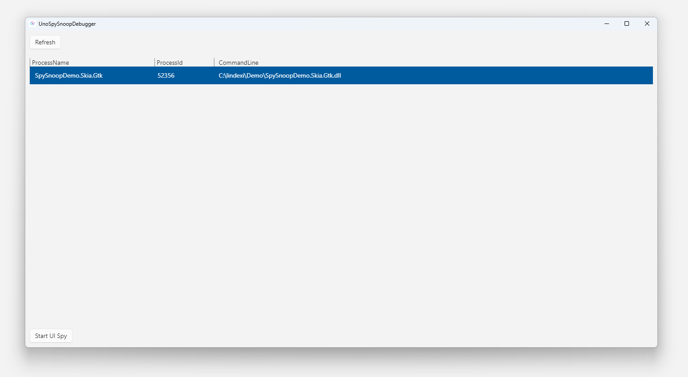

# UnoSpySnoop

[中文文档](./README_zh-cn.md)


[](https://www.nuget.org/packages/UnoSpySnoopProvider)

UnoSpySnoop is a tool for inspecting the runtime visual tree of a Skia platforms Uno app.

## Why This Tool is Needed

The reason for needing this tool is that on the Skia platform, both WPF and GTK use a Surface to render the interface. This results in the original WPF UI debugging tools, such as SnoopWpf, only being able to see an image and not being able to obtain the correct interface structure. UnoSpySnoop can effectively assist in interface development debugging on Skia-based desktop platforms, such as Skia.Wpf and Skia.Gtk, enhancing the efficiency of developers' interface development, especially when debugging Skia.Gtk applications on the Linux desktop.

## Usage

In the project where the UI interface is to be debugged, follow these preparation steps:

1. Install the NuGet package named UnoSpySnoopProvider.
2. Add a Grid control named SnoopRootGrid at the top level of the UI interface for subsequent display of the highlighted area. Please do not put any business logic interface in SnoopRootGrid, as the content of this SnoopRootGrid will be constantly cleared.
3. Use the StartSpyUI method of the SpySnoop static type in the UnoSpySnoop namespace, and pass SnoopRootGrid as a parameter to complete the preparation work. Here is an example code:

```csharp
public sealed partial class MainPage : Page
{
    public MainPage()
    {
        this.InitializeComponent();
#if HAS_UNO
        UnoSpySnoop.SpySnoop.StartSpyUI(SnoopRootGrid);
#endif
    }
}
```

After completing the above preparation work, you can run the project, then open the UnoSpySnoopDebugger tool, select the running project, and then click the `Start UI Spy` button to debug the UI interface.



## Thanks

Thank you [snoopwpf](https://github.com/snoopwpf/snoopwpf), this is the inspiration for this tool.
